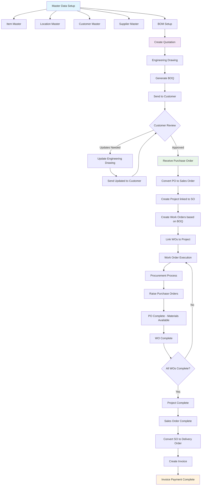

# MRP Platform Demo Flow - Engineer-to-Order Manufacturing Journey

## Demo Overview
This demo showcases an **Engineer-to-Order (ETO) manufacturing platform** where every customer order requires custom engineering design, detailed cost estimation, and precise production planning. The journey begins with master data setup and flows through quotation development, engineering drawings, project management, work order execution, and final invoicing.

**Part 1**: Master Data Setup & Foundation - Establishing the core ETO system infrastructure  
**Part 2**: End-to-End ETO Journey - Complete workflow from quotation to invoice payment

The prototype demonstrates the complete **engineering-driven manufacturing workflow** — from master data configuration and quotation development through engineering drawings, BOQ creation, project management, work order execution, procurement integration, and final delivery with invoicing.

---

## 🗺️ Complete ETO Manufacturing Journey

---

## 🎯 Demo Structure

### **Part 1: Master Data Setup & Foundation** ⭐ **ETO SYSTEM CONFIGURATION**
*Duration: 15-20 minutes*

#### 1.1 Item Master Setup
- **Item Categories**: Configure raw materials, components, sub-assemblies, and finished goods
- **Item Specifications**: Define technical specifications, material properties, and engineering parameters
- **Unit of Measure**: Set up primary and secondary units for different item types
- **Cost Information**: Configure standard costs, pricing, and cost calculation methods
- **Supplier Linkage**: Connect items to approved suppliers with qualification data

#### 1.2 Location Master Setup
- **Warehouse Configuration**: Set up main warehouse, sub-locations, and storage areas
- **Location Types**: Define raw material storage, work-in-progress, and finished goods areas
- **Location Parameters**: Configure capacity, handling equipment, and access controls
- **Inter-location Transfers**: Set up movement rules and transfer procedures

#### 1.3 Customer Master Setup
- **Customer Profiles**: Configure customer accounts with contact information and preferences
- **Engineering Requirements**: Set customer-specific engineering standards and approval processes
- **Pricing Agreements**: Define customer-specific pricing, terms, and conditions
- **Communication Preferences**: Configure document delivery and approval workflows

#### 1.4 Supplier Master Setup
- **Supplier Profiles**: Set up supplier accounts with contact and qualification information
- **Procurement Terms**: Define payment terms, delivery schedules, and quality requirements
- **Supplier Categories**: Organize by material types, services, and engineering capabilities
- **Performance Tracking**: Configure supplier evaluation and rating systems

#### 1.5 Bill of Materials (BOM) Setup
- **BOM Structure**: Create hierarchical component relationships for products
- **Component Specifications**: Define material requirements and engineering specifications
- **Quantity Calculations**: Set up quantity per assembly and waste factors
- **Version Control**: Establish BOM revision management and engineering change control
- **Cost Roll-up**: Configure cost calculation from components to finished products

---

### **Part 2: End-to-End ETO Journey** ⭐ **COMPLETE MANUFACTURING WORKFLOW**
*Duration: 25-30 minutes*

#### 2.1 Create Quotation
- **Customer Requirements**: Capture customer specifications and requirements
- **Initial Cost Estimation**: Calculate preliminary costs based on similar projects
- **Quotation Structure**: Set up quotation with line items, pricing, and terms
- **Document Management**: Attach relevant documents and specifications

#### 2.2 Engineering Drawing Development
- **Technical Analysis**: Engineering team analyzes customer requirements
- **Design Creation**: Develop detailed engineering drawings and specifications
- **Material Selection**: Choose appropriate materials and components
- **Manufacturing Review**: Validate design for production feasibility

#### 2.3 Generate Bill of Quantities (BOQ)
- **BOQ from Engineering**: Create detailed BOQ based on engineering drawings
- **Quantity Calculations**: Calculate precise material and component quantities
- **Cost Integration**: Link BOQ items to cost estimates and pricing
- **Review and Approval**: Engineering review of BOQ accuracy and completeness

#### 2.4 Send Quotation to Customer
- **Document Preparation**: Generate professional quotation with BOQ and drawings
- **Customer Communication**: Send quotation through preferred communication channel
- **Tracking**: Monitor quotation status and customer response timeline

#### 2.5 Engineering Drawing Updates (If Required)
- **Customer Feedback**: Process customer change requests and modifications
- **Drawing Revisions**: Update engineering drawings based on customer input
- **BOQ Updates**: Revise BOQ to reflect engineering changes
- **Cost Adjustments**: Update pricing based on design modifications
- **Re-send to Customer**: Deliver updated quotation and drawings

#### 2.6 Receive Purchase Order
- **PO Processing**: Customer submits purchase order with final specifications
- **Validation**: Verify PO against final quotation and engineering specifications
- **Order Confirmation**: Confirm order acceptance and delivery timeline

#### 2.7 Convert PO to Sales Order
- **Sales Order Creation**: Generate internal sales order from customer PO
- **Engineering Release**: Finalize all engineering drawings and specifications
- **Material Requirements**: Calculate final material and component needs
- **Production Planning**: Prepare for project and work order creation

#### 2.8 Create Project Linked to Sales Order
- **Project Initiation**: Create project structure linked to sales order
- **Project Planning**: Set up project timeline, milestones, and deliverables
- **Resource Allocation**: Assign project team and engineering resources
- **Documentation**: Establish project documentation and change control

#### 2.9 Create Work Orders Based on BOQ
- **Work Order Generation**: Create multiple work orders from BOQ structure
- **Operation Sequencing**: Define manufacturing sequence and dependencies
- **Resource Requirements**: Assign machines, labor, and tools to operations
- **Link to Project**: Connect all work orders to the parent project

#### 2.10 Work Order Execution & Procurement
- **Procurement Analysis**: Identify materials needed for each work order
- **Purchase Order Creation**: Raise purchase orders for required materials
- **Supplier Management**: Track supplier deliveries and material availability
- **Material Sufficiency Check**: Verify all materials available before production start

#### 2.11 Work Order Completion
- **Production Execution**: Complete manufacturing operations per work order
- **Quality Control**: Conduct inspections and quality checks
- **Progress Tracking**: Monitor work order progress and completion status
- **Documentation**: Record actual costs, time, and quality results

#### 2.12 Project Completion
- **Work Order Consolidation**: Verify all work orders completed successfully
- **Final Assembly**: Complete final assembly and testing if required
- **Quality Certification**: Conduct final quality inspection and certification
- **Project Closure**: Mark project as complete and update sales order status

#### 2.13 Sales Order to Delivery Order
- **Delivery Preparation**: Prepare finished goods for customer delivery
- **Delivery Order Creation**: Generate delivery order with shipping details
- **Logistics Coordination**: Arrange transportation and delivery schedule
- **Customer Notification**: Inform customer of delivery arrangements

#### 2.14 Invoice Creation and Payment
- **Invoice Generation**: Create customer invoice based on completed sales order
- **Cost Reconciliation**: Compare actual costs to original quotation
- **Document Package**: Include delivery proof and quality certificates
- **Payment Processing**: Track invoice payment and account reconciliation

---

## 🔧 Technical Implementation Highlights

### System Integration ⭐ **ETO PROTOTYPE FOCUS**
- **Engineering-Centric Database**: Single source of truth for all engineering data and specifications
- **API Architecture**: Seamless integration between engineering, quotation, BOM, and procurement modules
- **Real-time Updates**: Live data synchronization across core engineering modules with functional integration to later stages

### User Experience ⭐ **ETO PROTOTYPE FOCUS**
- **Engineering-First Design**: Role-based dashboards optimized for engineering and technical teams
- **Responsive Interface**: Works on desktop, tablet, and mobile with specialized engineering workflows
- **Accessibility**: WCAG compliant with specialized interfaces for engineering and technical teams

### Security & Compliance ⭐ **ETO PROTOTYPE FOCUS**
- **Engineering Data Security**: Granular permissions for engineering documents and specifications
- **Data Encryption**: Secure transmission and storage of engineering drawings and technical data
- **Audit Logging**: Complete activity tracking for engineering changes and approvals

---

## 📊 Demo Dashboard Views

### Part 1: Master Data & Configuration Views
- **Master Data Management**: Item, location, customer, and supplier configuration
- **BOM Structure Management**: Hierarchical component relationships and cost roll-ups
- **User Management**: Role and permission configuration for different departments
- **System Configuration**: Platform settings and integration parameters

### Part 2: Operational Dashboard Views
- **Quotation Pipeline**: Active quotations, engineering drawings, and BOQ development
- **Project Management**: Project status, work order progress, and milestone tracking
- **Procurement Status**: Purchase order status, material availability, and supplier performance
- **Production Overview**: Work order execution, completion status, and quality metrics
- **Financial Dashboard**: Revenue tracking, cost analysis, and invoice payment status

---

## 🎯 Key ETO Benefits Demonstrated

### Part 1: Foundation Benefits
- **Master Data Integrity**: Centralized management of items, locations, customers, and suppliers
- **BOM Management**: Structured component relationships with accurate cost calculations
- **Data Consistency**: Single source of truth across all modules and processes
- **Scalability**: Platform grows with business complexity and volume requirements

### Part 2: Workflow Benefits
- **End-to-End Traceability**: Complete visibility from quotation to invoice payment
- **Project Integration**: Seamless connection between sales orders, projects, and work orders
- **Procurement Optimization**: Integrated procurement with material availability tracking
- **Cost Control**: Real-time cost monitoring and actual vs. estimated comparison
- **Quality Assurance**: Structured processes with validation at every stage

---

## 📈 Success Metrics

### Part 1: Setup Metrics
- **Configuration Time**: 50% faster master data setup and BOM configuration
- **Data Accuracy**: 99%+ accuracy in master data and cost calculations
- **User Training**: 70% reduction in training time across departments

### Part 2: Operational Metrics
- **Quotation Lead Time**: 40% faster from quotation to customer approval
- **Project Delivery**: 95%+ on-time project completion rate
- **Cost Accuracy**: 95%+ accuracy in cost estimates vs. actual costs
- **Procurement Efficiency**: 30% reduction in material shortage delays
- **Invoice Processing**: 50% faster invoice creation and payment processing

---

## 🏭 Engineer-to-Order Business Characteristics

### **Custom Engineering Requirements**
- Every customer order requires unique engineering design and analysis
- Technical specifications drive material selection and manufacturing processes
- Engineering labor and expertise are significant cost components
- Design changes during quotation process are common and must be managed

### **Engineering-Driven Cost Structure**
- Engineering labor costs are major pricing factors
- Material costs vary significantly based on custom specifications
- Manufacturing complexity drives production time and cost estimates
- Overhead allocation must account for engineering department costs

### **Quality and Compliance Focus**
- Engineering specifications define quality standards and acceptance criteria
- Regulatory compliance requirements drive design and documentation needs
- Engineering change control is critical for maintaining quality and traceability
- Customer approval processes often require engineering documentation

---

*This demo showcases the complete integration and value proposition of the ETO MRP platform through a structured two-part approach: first establishing the master data foundation, then demonstrating the complete manufacturing workflow. The prototype demonstrates the end-to-end process from quotation through engineering drawings, BOQ development, project management, work order execution, procurement integration, and final delivery with invoicing - providing complete visibility and control over the entire manufacturing process.*

## TODO

- [x] ~~Add BOQ approval workflow before sending to customer~~
- [x] ~~Fix BOQ items auto-population from quotation selection~~
- [x] ~~Add item master selection for new BOQ items~~
- [x] ~~Auto-populate Created By field in BOQ creation~~
- [x] ~~Add linked quotation reference and navigation in BOQ details page~~
- [x] ~~Remove BOM generation from BOQ since items are sourced from item master~~
- [x] ~~Add send to customer functionality with email preview in quotation details page~~
- [x] ~~Store status of engineering drawing, BOQ and quotation in the database~~
- [x] ~~Add complete quotation functionality by converting to sales order~~
- [x] ~~Add Mark PO Received functionality to enable quotation completion~~
- [x] ~~Add file upload functionality for PO documents in Mark PO Received dialog~~
- [x] ~~Update quotation status to Completed when converting to sales order~~
- [x] ~~Add comprehensive links to related documents in quotation details page~~
- [x] ~~Fix sales order creation and navigation issue ("SO not found" error)~~

## Completed Features
